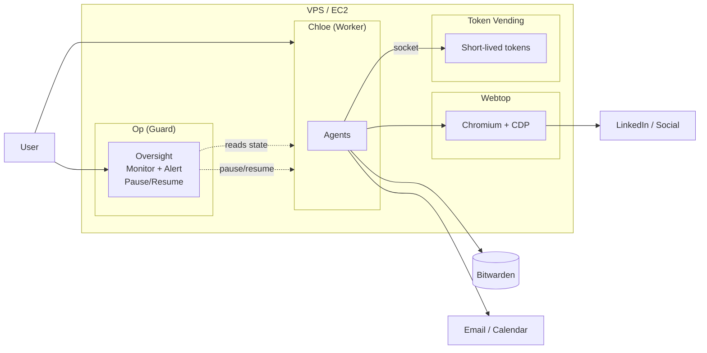

# op-and-chloe

<p align="center">
  
</p>

`op-and-chloe` ("openclaw-ey") is a two-instance OpenClaw stack for any VPS or cloud instance.

- **🐕 Op**: monitoring/oversight instance — watches Chloe in real-time, alerts on suspicious activity, can pause her
- **🐯 Chloe**: day-to-day instance — create all agents here; has Bitwarden, email, M365, webtop
- **🖥️ Webtop**: Chromium + CDP for shared browser (you + Chloe)
- **🔐 Passwordless**: Bitwarden in Chloe; login/unlock interactive only, no secrets in files
- **🎟️ Token vending**: short-lived credentials for GitHub, Google, Notion, Slack — secrets never reach Chloe
- **❤️ Healthcheck + watchdog**

> 🚀 Just run `sudo ./setup.sh` and follow the wizard! 🎉

---

## Quick start

SSH into your server and follow the setup wizard step-by-step.

```bash
git clone https://github.com/nickbanqora/op-and-chloe.git
cd op-and-chloe
sudo ./setup.sh
```

## How to update

```bash
cd op-and-chloe
git pull
sudo ./start.sh
```

---

# Components

The stack consists of four containers on isolated Docker networks:

### 1. Chloe (Worker)

**Chloe** is your day-to-day instance. Create all agents here. She has Bitwarden, email (Himalaya, M365), and shared browser access via webtop.

Chloe requests short-lived credentials from the token-vending service via a Unix socket — she never sees the underlying private keys or client secrets.

### 2. Op (Guard)

**Op** is the monitoring and oversight instance. Op's job is to:
- watch Chloe's activity in real-time via a session watcher
- alert you via Slack/Telegram if something looks suspicious
- pause Chloe immediately if needed (SIGSTOP via sentinel file)
- wait for your approval before resuming

Op has **read-only** access to Chloe's state and workspace. No Docker socket, no SSH, no host access. For admin tasks (restarts, deploys), SSH to the host directly.

**Admin mode** is available as an emergency escalation in the setup wizard (step 15) — it temporarily grants Op Docker socket and SSH access. Disable when done.

### 3. Browser (Webtop)

A shared Chromium browser that both you and Chloe use. You log in to sites once; Chloe uses the same session via CDP. Useful for co-working: Chloe drafts a LinkedIn reply, you review and send.

### 4. Token Vending

A credential broker that holds long-lived secrets (GitHub App keys, Google service accounts, Notion OAuth) and vends short-lived tokens to Chloe via a Unix socket. Secrets are mounted read-only; refresh tokens (e.g. Notion) are written to a separate writable volume.

Configured providers: GitHub, Google, Notion, Slack, Keychain (static secrets).

---

## Architecture



## Network isolation

Each container runs on its own Docker network with minimal connectivity:

| Container | Networks | Can reach |
|---|---|---|
| Chloe | `openclaw_net`, `control_net` | Browser (CDP), Token vending (socket), Op (control net) |
| Op | `control_net` | Chloe state (read-only mount), guard-control volume |
| Browser | `openclaw_net` | Internet (for web browsing) |
| Token vending | `token_vending_egress` | Internet (for token exchange APIs) |

All gateway ports (18789, 18790, 6080) are bound to `127.0.0.1` — not accessible from the network. Access via SSH tunnel or Tailscale (optional).

## Security model

- **Op is monitoring-only** by default: read-only mounts, no Docker socket, no SSH. Can pause Chloe via sentinel file.
- **Token vending secrets are read-only**: private keys and client secrets mounted `:ro`. Only refresh tokens (Notion) get a separate writable volume.
- **No master password on disk**: Bitwarden vault unlocked interactively; only session key persisted.
- **Peer credential logging**: token-vending logs UID/GID/PID of every request.
- **Tailscale is optional**: skip if your network already provides private access (e.g. AWS VPN).
- **Admin mode is emergency-only**: step 15 in wizard, adds Docker socket + SSH temporarily.

## Bitwarden in Chloe

Chloe has **Bitwarden** in her container. She uses **`bw`** to read from the vault; session lives in worker state.

```bash
bw list items
bw get item <id>
```

## Token vending

Chloe requests short-lived tokens via Unix socket:

```bash
curl -s --unix-socket /var/run/token-vending/vending.sock http://localhost/token/github
curl -s --unix-socket /var/run/token-vending/vending.sock http://localhost/health
```

Configure providers in `/etc/token-vending/config.yaml`. See `token-vending/README.md`.

## CLI Commands

```bash
sudo ./setup.sh          # Run setup wizard
sudo ./start.sh           # Build and start all services
sudo ./stop.sh            # Stop all services
sudo ./healthcheck.sh     # Full health check

./openclaw-guard <cmd>    # Run OpenClaw CLI for Op
./openclaw-worker <cmd>   # Run OpenClaw CLI for Chloe
```

## Troubleshooting

**Gateway "device token mismatch":**
Recreate containers to pick up current tokens: `sudo ./stop.sh && sudo ./start.sh`

**Dashboard URLs return HTTP 502:**
Gateways take 60-90s to start. Wait and refresh, or check `sudo docker logs <container>`.

**Chloe's browser tool shows cdpReady: false:**
Run `sudo ./scripts/host/update-webtop-cdp-url.sh` to refresh the CDP URL in worker state.

**Op not responding in Slack:**
Check `sudo docker logs op-and-chloe-openclaw-guard` for errors. Common issues: exec approval gates, model API key not in `auth-profiles.json`.

## Docs

- **OpenClaw**: [https://docs.openclaw.ai](https://docs.openclaw.ai)

## License

This project is licensed under the [MIT License](LICENSE).
